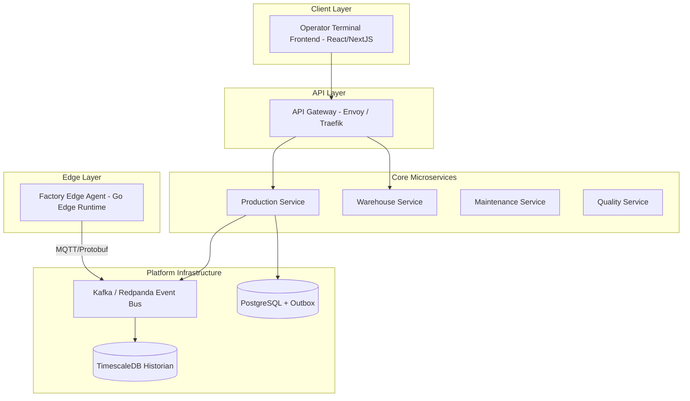

# Architecture Specification: C4 Container Diagram

## 1. Container Topology

---

## 2. Container Descriptions

* **Edge Agent:** Installed locally at factory sites. Ingests OPC-UA PLC signals and buffers data offline.
* **Production Service:** Manages station execution, state machine progression, and operator dispatch.
* **Warehouse Service:** Tracks material lots and genealogy as-built component assembly.
* **Kafka Event Bus:** Asynchronous backbone routing domain events across microservices.
