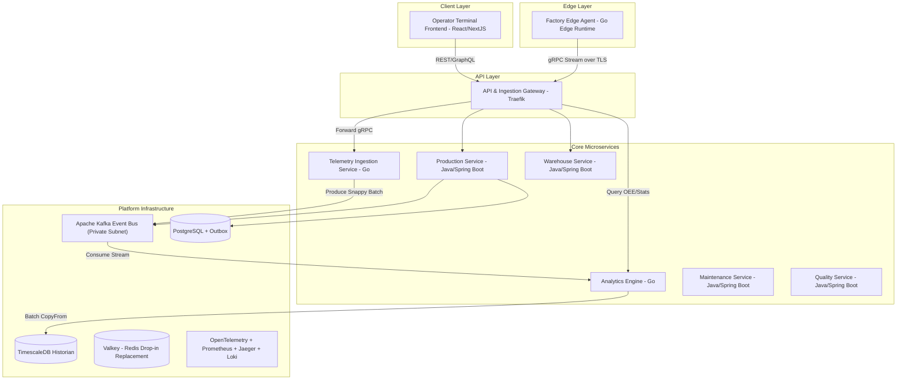

# Architecture Specification: C4 Container Diagram

## 1. Container Topology

---

## 2. Container Descriptions

* **Edge Agent:** Installed locally at factory sites. Ingests OPC-UA PLC signals and buffers data in local SQLite when offline.
* **API Gateway (Traefik):** Single public entrypoint for TLS termination, JWT verification, and routing REST/gRPC traffic.
* **Telemetry Ingestion Service:** High-throughput Go gRPC service that authenticates edge nodes, validates Protobuf batches, and produces them into Kafka `telemetry.raw.v1`.
* **Analytics Engine:** Consumes real-time streams from Kafka, evaluates dynamic thresholds in memory, calculates OEE, and streams micro-batches into TimescaleDB via `pgx.CopyFrom`.
* **Production Service:** Manages station execution, state machine progression, and operator dispatch.
* **Warehouse Service:** Tracks material lots and genealogy as-built component assembly.
* **Kafka Event Bus:** Asynchronous backbone routing domain events across microservices in private cloud subnets.
