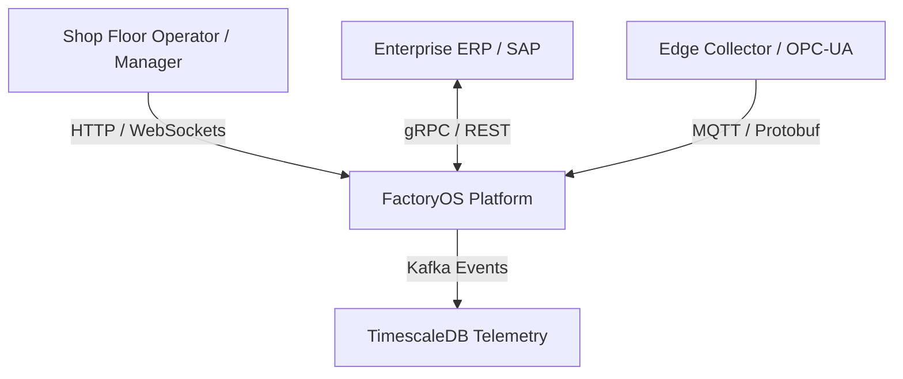

# Architecture Specification: C4 System Context Diagram

## 1. Context Overview

FactoryOS sits at Level 3 (MES/MOM) of the ISA-95 pyramid, bridging Level 4 (ERP/Business Systems) and Level 1/2 (PLCs, Sensors, Edge Devices).

---

## 2. External System Boundaries

* **ERP Systems (SAP/NetSuite):** Pushes Purchase Orders and Master BOMs; receives completed Work Order receipts.
* **Shop Floor Machinery:** Emits OPC-UA/MQTT telemetry signals through Edge Runtimes.
* **Operator Terminals:** Displays real-time station instructions, quality checklists, and downtime alerts.
