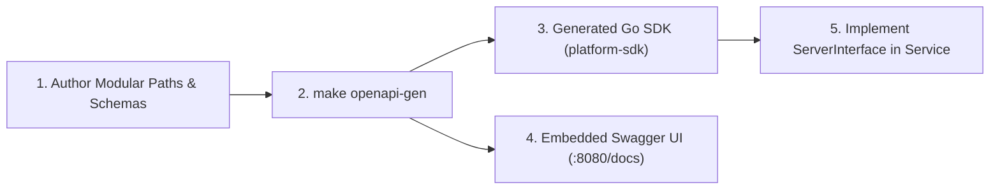

# FactoryOS API & Contract Governance Guide

This document outlines the API standards, contract formats, and code generation workflows for **FactoryOS**.

---

## 1. Multi-Protocol Contract Architecture

FactoryOS strictly segregates communication protocols based on performance and integration requirements:

| API Protocol | Contract Standard | Directory Location | Target Use Case |
| :--- | :--- | :--- | :--- |
| **gRPC / HTTP/2** | Protocol Buffers (v3) | `api/contracts/<domain>/v1/*.proto` | High-frequency telemetry ingestion, synchronous inter-service RPC |
| **RESTful (JSON)** | OpenAPI (3.0 / 3.1) | `api/contracts/openapi/<domain>/v1/openapi.yaml` | Web UI Dashboard, Mobile Apps, SAP/MES ERP Integration |
| **Event Bus** | Protobuf / AsyncAPI | `api/contracts/events/` | Asynchronous Kafka event publishing and consuming |

---

## 2. Schema-First OpenAPI Modular Architecture

To prevent API specifications from becoming monolithic and unmaintainable as FactoryOS scales, OpenAPI 3.0/3.1 contracts are decomposed into **Domain Subfolders** and **Modular Path Files**:

```
api/contracts/openapi/
├── common/v1/                               # Shared reusable schemas across domains
│   └── schemas/
│       ├── errors.yaml                      # ErrorResponse
│       └── health.yaml                      # HealthStatusResponse, ReadinessResponse
└── telemetry/v1/                            # Telemetry & Analytics Domain
    ├── openapi.yaml                         # Root domain entrypoint with $ref paths
    ├── paths/                               # One file per endpoint group
    │   ├── healthz.yaml                     # GET /healthz
    │   ├── ready.yaml                       # GET /ready
    │   ├── stats.yaml                       # GET /stats
    │   ├── latest.yaml                      # GET /telemetry/latest
    │   ├── history.yaml                     # GET /telemetry/history
    │   └── alerts.yaml                      # GET /telemetry/alerts
    └── schemas/                             # Domain-specific DTO models
        ├── telemetry.yaml                   # SensorQuality, TelemetryReading
        ├── aggregate.yaml                   # TelemetryAggregateBucket
        ├── alert.yaml                       # ActiveAlert
        └── stats.yaml                       # ServiceStatsResponse
```



### Steps to Add a New REST Endpoint:
1. **Define Contract:** Create or update `api/contracts/openapi/<domain>/v1/openapi.yaml`.
2. **Generate Stubs:** Run `make openapi-gen`.
3. **Implement Server Interface:** In your service (`services/<service-name>/`), implement the generated `ServerInterface` from `platform/platform-sdk/go/gen/openapi/<domain>/v1/`.
4. **Mount Swagger UI:** Mount the embedded documentation handler:
   ```go
   r.Get("/docs", swaggerui.Handler("Service API", telemetryv1.OpenAPISpec))
   ```

---

## 3. Standard Observability & Operational Endpoints

Every FactoryOS microservice MUST expose standard operational endpoints for Kubernetes orchestration, load balancer health checks, and Prometheus metrics scraping:

| Endpoint | Method | Response Code | Purpose |
| :--- | :--- | :--- | :--- |
| `/healthz` | `GET` | `200 OK` | **Liveness Probe:** Process is alive and event loop is not deadlocked. |
| `/ready` | `GET` | `200 OK` / `503 Unavailable` | **Readiness Probe:** All backing connections (TimescaleDB pool, Kafka broker, Valkey) are established and ready to accept live traffic. |
| `/stats` | `GET` | `200 OK` (JSON) | **Runtime Stats:** Real-time throughput (messages consumed, batches flushed, error rates, dropped records). |
| `/metrics` | `GET` | `200 OK` (Prometheus) | **Prometheus Scraper:** Standard Prometheus exposition format. |
| `/docs` | `GET` | `200 OK` (HTML) | **Interactive Documentation:** Embedded Scalar / Swagger UI API reference. |

---

## 4. Code Generation Commands

```bash
# Generate Go & Java Protobuf stubs (Buf)
make proto-gen

# Lint Protobuf contracts
make proto-lint

# Generate Go OpenAPI models, clients, and chi-server interfaces
make openapi-gen
```
