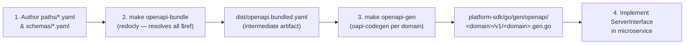

# FactoryOS API & Contract Governance Guide

This document outlines the API standards, contract formats, and code generation workflows for **FactoryOS**.

---

## 1. Multi-Protocol Contract Architecture

FactoryOS strictly segregates communication protocols based on performance and integration requirements:

| API Protocol | Contract Standard | Directory Location | Target Use Case |
| :--- | :--- | :--- | :--- |
| **gRPC / HTTP/2** | Protocol Buffers (v3) | `api/contracts/<domain>/v1/*.proto` | High-frequency telemetry ingestion, synchronous inter-service RPC |
| **RESTful (JSON)** | OpenAPI (3.0 / 3.1) | `api/contracts/openapi/<domain>/v1/openapi.yaml` | Web UI Dashboard, Mobile Apps, SAP/MES ERP Integration |
| **Event Bus** | Protobuf / AsyncAPI | `api/contracts/events/` | Asynchronous Kafka event publishing and consuming |

---

## 2. Schema-First OpenAPI Modular Architecture

To prevent API specifications from becoming monolithic and unmaintainable as FactoryOS scales, OpenAPI 3.0/3.1 contracts are decomposed into **per-domain folders** and **modular path files**. Each domain is fully independent — adding a new service never requires touching another domain's spec.

### Directory Layout

```
api/contracts/openapi/
└── <domain>/                                # One folder per microservice domain
    └── v1/
        ├── openapi.yaml                     # [SOURCE] Root entrypoint — lists paths via $ref
        ├── paths/                           # [SOURCE] One file per endpoint group
        │   ├── healthz.yaml                 # GET /healthz
        │   ├── ready.yaml                   # GET /ready
        │   └── ...
        ├── schemas/                         # [SOURCE] Domain-specific DTO models
        │   ├── common.yaml                  # HealthStatusResponse, ErrorResponse
        │   └── ...
        └── dist/                            # [GENERATED] gitignored — do not edit manually
            └── openapi.bundled.yaml         # redocly bundle output (single resolved file)
```

> **Key principle:** `dist/` and `platform/platform-sdk/go/gen/` are both **gitignored**. Only source specs
> in `paths/` and `schemas/` are committed. Generated artifacts are rebuilt automatically in every CI run.

### Build Pipeline



### Makefile Commands

```bash
# [Step 1] Bundle all multi-file domain specs (auto-discovers all openapi.yaml)
make openapi-bundle    # → api/contracts/openapi/<domain>/v1/dist/openapi.bundled.yaml

# [Step 2] Generate Go SDKs for all discovered domains (runs openapi-bundle first)
make openapi-gen       # → platform/platform-sdk/go/gen/openapi/<domain>/v1/<domain>.gen.go
                       #   Package names: telemetryv1, resourcev1, productionv1, …
```

### Steps to Add a New Domain or Endpoint

1. **New domain:** Create `api/contracts/openapi/<domain>/v1/openapi.yaml` — `make openapi-gen` auto-discovers it.
2. **New endpoint:** Add `paths/<group>.yaml`, reference it from `openapi.yaml` via `$ref`.
3. **Run generation:** `make openapi-gen` — bundle + codegen runs for all domains.
4. **Implement:** In your service, implement the generated `ServerInterface`.
5. **Mount Swagger UI:**
   ```go
   r.Get("/docs", swaggerui.Handler("Service API", telemetryv1.OpenAPISpec))
   ```

---

## 3. Standard Observability & Operational Endpoints

Every FactoryOS microservice MUST expose standard operational endpoints for Kubernetes orchestration, load balancer health checks, and Prometheus metrics scraping:

| Endpoint | Method | Response Code | Purpose |
| :--- | :--- | :--- | :--- |
| `/healthz` | `GET` | `200 OK` | **Liveness Probe:** Process is alive and event loop is not deadlocked. |
| `/ready` | `GET` | `200 OK` / `503 Unavailable` | **Readiness Probe:** All backing connections (TimescaleDB pool, Kafka broker, Valkey) are established and ready to accept live traffic. |
| `/stats` | `GET` | `200 OK` (JSON) | **Runtime Stats:** Real-time throughput (messages consumed, batches flushed, error rates, dropped records). |
| `/metrics` | `GET` | `200 OK` (Prometheus) | **Prometheus Scraper:** Standard Prometheus exposition format. |
| `/docs` | `GET` | `200 OK` (HTML) | **Interactive Documentation:** Embedded Scalar / Swagger UI API reference. |

---

## 4. Code Generation Commands

```bash
# Generate Go & Java Protobuf stubs (Buf)
make proto-gen

# Lint Protobuf contracts
make proto-lint

# Bundle multi-file OpenAPI specs per domain (via Redocly)
make openapi-bundle

# Bundle + Generate Go OpenAPI models, clients, and chi-server interfaces for all domains
make openapi-gen
```
