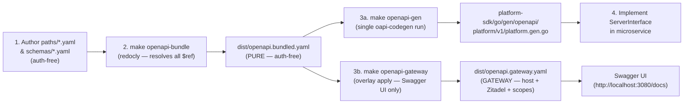

# FactoryOS API & Contract Governance Guide

This document outlines the API standards, contract formats, and code generation workflows for **FactoryOS**.

---

## 1. Multi-Protocol Contract Architecture

FactoryOS strictly segregates communication protocols based on performance and integration requirements:

| API Protocol | Contract Standard | Directory Location | Target Use Case |
| :--- | :--- | :--- | :--- |
| **gRPC / HTTP/2** | Protocol Buffers (v3) | `api/contracts/<domain>/v1/*.proto` | High-frequency telemetry ingestion, synchronous inter-service RPC |
| **RESTful (JSON)** | OpenAPI (3.0 / 3.1) | `api/contracts/openapi/openapi.yaml` | Web UI Dashboard, Mobile Apps, SAP/MES ERP Integration |
| **Event Bus** | Protobuf / AsyncAPI | `api/contracts/events/` | Asynchronous Kafka event publishing and consuming |

---

## 2. Schema-First OpenAPI Modular Architecture

FactoryOS ships a **single unified OpenAPI entrypoint** (`api/contracts/openapi/openapi.yaml`)
so Swagger UI renders all services on one page. The root file is pure `$ref` composition —
endpoint fragments stay decomposed per domain under `production/v1/paths/`,
`telemetry/v1/paths/`, and shared models under `common/`. Adding a new service means adding
its `paths/` + `schemas/` fragments and one `$ref` block in the root file.

### Directory Layout

```
api/contracts/openapi/
├── openapi.yaml                       # [SOURCE] Single entrypoint — all paths/components via $ref
├── config.yaml                        # [SOURCE] oapi-codegen config (package platformv1)
├── common/v1/                         # [SOURCE] Shared parameters, responses, schemas
├── production/v1/paths|schemas/       # [SOURCE] Work-order endpoint + DTO fragments
├── telemetry/v1/paths|schemas/        # [SOURCE] Telemetry endpoint + DTO fragments
├── overlays/                          # [SOURCE] Gateway overlay (Overlay Spec 1.0, Swagger UI only)
│   └── gateway.overlay.yaml           # host + Zitadel scheme + per-operation scopes
└── dist/                              # [GENERATED] gitignored — do not edit manually
    ├── openapi.bundled.yaml           # [PURE] redocly bundle output — auth-free, for oapi-codegen
    └── openapi.gateway.yaml           # [GATEWAY] overlay applied — for Swagger UI only, never codegen
```

> **Key principle:** `dist/` and `platform/platform-sdk/go/gen/` are both **gitignored**. Only source specs
> in `paths/` and `schemas/` are committed. Generated artifacts are rebuilt automatically in every CI run.

### Build Pipeline


```mermaid
graph LR
    A["1. Author paths/*.yaml\n& schemas/*.yaml\n(auth-free)"] --> B["2. make openapi-bundle\n(redocly — resolves all $ref)"]
    B --> C["dist/openapi.bundled.yaml\n(PURE — auth-free)"]
    C --> D["3a. make openapi-gen\n(single oapi-codegen run)"]
    C --> G["3b. make openapi-gateway\n(overlay apply — Swagger UI only)"]
    D --> E["platform-sdk/go/gen/openapi/\nplatform/v1/platform.gen.go"]
    E --> F["4. Implement ServerInterface\nin microservice"]
    G --> H["dist/openapi.gateway.yaml\n(GATEWAY — host + Zitadel + scopes)"]
    H --> I["Swagger UI\n(http://localhost:3080/docs)"]
```

> **Contract vs gateway split ([ADR-0008](../05-adr/0008-openapi-contract-gateway-overlay-split.md)):**
> versioned spec is 100% auth-free (relative `servers: /api/v1`, no `security` blocks).
> Gateway auth (host, Zitadel `openIdConnect` scheme, per-operation scopes) lives only in
> `api/contracts/openapi/overlays/gateway.overlay.yaml` and is applied post-bundle by
> `make openapi-gateway`. Codegen consumes the pure bundle; Swagger UI serves the gateway file
> (override with `SWAGGER_SPEC_FILE=dist/openapi.bundled.yaml`).

### Makefile Commands

```bash
# [Step 1] Bundle the unified platform spec
make openapi-bundle    # → api/contracts/openapi/dist/openapi.bundled.yaml (PURE)

# [Step 1b] Validate + apply the gateway overlay (Swagger UI only, never codegen)
make openapi-gateway   # → api/contracts/openapi/dist/openapi.gateway.yaml

# [Step 2] Generate the single Go SDK from the PURE bundle (runs openapi-bundle first)
make openapi-gen       # → platform/platform-sdk/go/gen/openapi/platform/v1/platform.gen.go
                       #   Package name: platformv1
```

### Steps to Add a New Domain or Endpoint

1. **New endpoint:** Add `paths/<group>.yaml` under the domain folder, reference it from the root
   `api/contracts/openapi/openapi.yaml` via `$ref` (paths + components).
2. **New domain:** Create `api/contracts/openapi/<domain>/v1/paths|schemas/` fragments and wire
   them into the root `openapi.yaml` — no new entrypoint or codegen config needed.
3. **Run generation:** `make openapi-gen` — bundle + single codegen run.
4. **Implement:** In your service, implement the generated `ServerInterface`.
5. **View docs (dev-only Docker Swagger UI):**
   ```bash
   make docs-up    # bundles specs + applies gateway overlays, starts swagger-ui -> http://localhost:3080/docs
   ```
   The `swagger-ui` service (`docker-compose.docs.yml` overlay, opt-in)
   renders the gateway spec (`dist/openapi.gateway.yaml`) with the official `swaggerapi/swagger-ui` image.
   Set `SWAGGER_SPEC_FILE=dist/openapi.bundled.yaml` to preview the pure auth-free bundle instead.

---

## 2b. REST Design Standards

Collection endpoints follow three companion standards:

- [PAGINATION_DESIGN.md](PAGINATION_DESIGN.md) — page/cursor pagination, `{data, meta}` envelope.
- [QUERY_CONVENTIONS.md](QUERY_CONVENTIONS.md) — filtering, sorting, full-text search, sparse fieldsets.
- [ERROR_HANDLING.md](ERROR_HANDLING.md) — error taxonomy and RFC 9457 wire format.

## 3. Standard Observability & Operational Endpoints

Every FactoryOS microservice MUST expose standard operational endpoints for Kubernetes orchestration, load balancer health checks, and Prometheus metrics scraping:

| Endpoint | Method | Response Code | Purpose |
| :--- | :--- | :--- | :--- |
| `/healthz` | `GET` | `200 OK` | **Liveness Probe:** Process is alive and event loop is not deadlocked. |
| `/ready` | `GET` | `200 OK` / `503 Unavailable` | **Readiness Probe:** All backing connections (TimescaleDB pool, Kafka broker, Valkey) are established and ready to accept live traffic. |
| `/stats` | `GET` | `200 OK` (JSON) | **Runtime Stats:** Real-time throughput (messages consumed, batches flushed, error rates, dropped records). |
| `/metrics` | `GET` | `200 OK` (Prometheus) | **Prometheus Scraper:** Standard Prometheus exposition format. |
| `/docs` | `GET` | `200 OK` (HTML) | **Interactive Documentation:** Embedded Scalar / Swagger UI API reference. |

> These are internal ops endpoints: probed/scraped directly per service, never gateway-routed.
> The OpenAPI platform contract (`api/contracts/openapi/openapi.yaml`) carries business APIs
> only — no `/healthz`, `/ready`, `/stats`, `/metrics`. That's what keeps the merged spec
> collision-free without path namespacing.

---

## 4. Code Generation Commands

```bash
# Generate Go & Java Protobuf stubs (Buf)
make proto-gen

# Lint Protobuf contracts
make proto-lint

# Lint the unified platform OpenAPI contract
make openapi-lint

# Bundle the unified platform spec (via Redocly)
make openapi-bundle

# Bundle + Generate the single Go OpenAPI model, client, and chi-server interface
make openapi-gen
```
